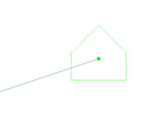

# Get started
The main ribbon consist of five categories of buttons - the introduction of settings and processing of the drawing, insertion of components and annotations, calculations and preview of results, printouts.

!<----------------->
## Settings and drawing processing
!<----------------->

_Open_

The button allowing to select the appropriate .dwg file from the computer. 


_Select reference file_

Uploading a document through the button dedicated to the file type. 
```
NOTE! The file must be in a good scale.The tool is working on meter units (1 unit=1 meter).
```
| | Attach .pdf file  |
| :---------:| ------------------|
|            | Attach .png file |
| | Attach .dwg file |
| | Close| 

!<----------------->

_Scale_

The scale button is used to adjust the size of the object being measured on the drawing, especially project drawing. By clicking on the scale button, the program will scale the features according to the queries: specific base point, specify reference length or point, specific second point, specific new length of point.  

For more [Resize or rescale](https://www.autodesk.com/support/technical/article/caas/sfdcarticles/sfdcarticles/How-to-resize-or-rescale-an-AutoCAD-drawing.html/).

_Settings_ 

The button that opens the General settings window. 
!<----------------->

_Producer_

The producer must be inserted to proceed with the design process. When inserting the producer, select a specific number of outputs from the drop-down list. 


Below an example of the Producer with one ouput.

   
```
NOTE 1! Proper insertion of the icon is very important. 
It can not be rotated. Below are examples of incorrect producer placement. 
In such cases, the project will not be calculated and an error message will be displayed: 
[Error] „The producer has been rotated, please restore it to original 
position”. 
```

```
NOTE 2! It is also important that the selected type of Producer has the appropriate number of
outputs. 
This means that when inserting an icon of a producer with one output,only one trench will
be drawn. 
If another line is inserted, the program will display an error message: 
[Error] “Too many trenches connected to the producer’s outlet!Please change the producer to
another one with more outlets.”  
```
_Consumer_

Before inserting a component into the drawing, a window with data will appear, more extensively explained in the Consumer description. <br/>


The Consumer icon can be inserted in custom preferences – it can be rotated. 

_Junction_

The junction element is used to connect consumers to the producer. Below is an example of a junction box with 6 outputs. <br/>

```
NOTE! From one junction, a maximum of 7 outputs can be connected. 
If more trenches are inserted, an error message will appear:
[Warning] „The created connection in the junction” Junction name” is impossible. 
The maximum number of trenches from one junction is 7. Please check possible connection
combinations.”   
```
_Trench_

A trench refers to a line connecting components. During the drawing process, it appears in green color. It is important to ensure that the line remains green during drawing; otherwise, it should be deleted and inserted again.
In the finalized project, the lines are marked in blue.

In the project below, a part of the path required redesigning. The blue trenches were already calculated and marked, while the newly inserted path is highlighted in green.


After performing calculations, unconnected elements are marked with a red circle.


It is necessary to check the correctness of the connection and recalculate the project if needed. 

In case the producer has more than one departure, for each circuit its layer must be changed via layer properties in the AutoCAD ribbon. 


Below an example:


```
NOTE! The layers should be changed before the hydraulic calculations. 
```

_Annotations_

The previously defined data for annotations are placed on the drawing after clicking the Annotations button. There is an option to manually insert annotations for each drawn element or automatic annotation generation for the entire drawing.


When choosing the option for manually inserting annotations, you need select the item and specify the location where the table should be placed on the drawing.

_Automatic annotations_

Automatically inserting annotations will place a label next to each component on the drawing. The placement of the table can be edited, allowing you to adjust its location on the drawing.
## Hydraulic calculations and properites
_Hydraulic calculations_ 

!<----------------->


After clicking on the hydraulic calculations button, if there are no errors in the project, the plug-in will run calculations and generate the project report. If there are any errors or warnings, the list of issues will be displayed.The errors can be preview later on command text box.

_Info_

The "Info" button allows to preview and modify the settings entered for inserted elements such as producers, consumers, junctions and trenches. The window for this functionality is further defined in the description of the respective inserted elements.

_Junction preview_

The option to preview the selected junction. 
## Printouts
_Results_


!<----------------->

By clicking on this button, the user can access a summary or detailed overview of the previously calculated results. The results window is described in detail in the "Results" chapter. Before generating the report, the program always prompts for project recalculation.


_Print_

The "Print" button activates the system's print window in AutoCAD.


_Save drawing as_

To save the project, give it a name and select the file location and proper version of AutoCAD type. 


For more [Print](https://www.troteclaser.com/en/learn-support/helpcenter/printing-from-autocad/).


Close

!<----------------->

_Close_
The Close button closes the ribbon window.
